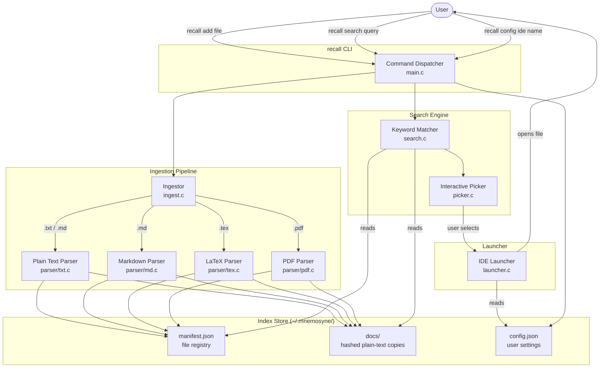

# System Architecture

## Overview

Mnemosyne is a local-first, command-line file search tool. It ingests plain and document files into a local index, then lets you search across all of them and open results directly in your preferred IDE.

---

## Component Diagram



---

## Component Descriptions

### `main.c` — Command Dispatcher
Entry point. Parses `argv` and routes to the correct handler:

| Subcommand | Handler |
|---|---|
| `add` | `ingest_file()` |
| `search` | `search_query()` → `picker_run()` |
| `config` | `config_set()` |
| `list` | `index_list()` |
| `remove` | `index_remove()` |

### `ingest.c` — Ingestor
Detects file extension, delegates to the correct parser, then writes the resulting plain text into `~/.mnemosyne/index/docs/<sha256>.txt` and updates `manifest.json`.

### `parser/` — Format Parsers
Each parser receives a file path and returns a heap-allocated `char *` of plain text. The caller owns the buffer and frees it.

| File | Handles | Strategy |
|---|---|---|
| `txt.c` | `.txt` | `fread` directly |
| `md.c` | `.md` | strip `#`, `*`, `_`, `` ` `` markers |
| `tex.c` | `.tex` | strip `\command{...}` patterns |
| `pdf.c` | `.pdf` | shell out to `pdftotext -` (poppler) |

### `index.c` — Index Store
Reads and writes `manifest.json`. Each entry:

```json
{
  "original_path": "/home/user/notes.txt",
  "hash": "a3f5c9...",
  "size_bytes": 4096,
  "last_modified": 1718400000,
  "file_type": "txt"
}
```

Functions: `index_add()`, `index_remove()`, `index_list()`, `index_find_by_path()`.

### `search.c` — Keyword Matcher (v1)
Iterates over all `docs/<hash>.txt` files. For each, counts occurrences of the query string using `strstr()`. Builds a ranked result list (descending match count), with ±2 lines of surrounding context per match.

### `picker.c` — Interactive Picker
Renders the ranked result list to the terminal. Accepts numeric input to select a file, or `q` to quit. Returns the selected `original_path`.

### `config.c` — Config Manager
Reads/writes `~/.mnemosyne/config.json`. Currently stores:

```json
{
  "ide": "code"
}
```

### `launcher.c` — IDE Launcher
Builds the shell invocation `<ide> <filepath>` from the config and calls `system()`. Supported IDE keys → commands:

| Key | Command |
|---|---|
| `code` | `code <file>` |
| `cursor` | `cursor <file>` |
| `nvim` | `nvim <file>` |
| `vim` | `vim <file>` |
| `nano` | `nano <file>` |
| `idea` | `idea <file>` |

---

## Source File Structure

```
Mnemosyne/
├── src/
│   ├── main.c
│   ├── ingest.c
│   ├── ingest.h
│   ├── index.c
│   ├── index.h
│   ├── search.c
│   ├── search.h
│   ├── picker.c
│   ├── picker.h
│   ├── launcher.c
│   ├── launcher.h
│   ├── config.c
│   ├── config.h
│   └── parser/
│       ├── txt.c
│       ├── txt.h
│       ├── md.c
│       ├── md.h
│       ├── tex.c
│       ├── tex.h
│       ├── pdf.c
│       └── pdf.h
├── tests/
│   ├── test_ingest.c
│   ├── test_search.c
│   ├── test_index.c
│   └── test_config.c
├── documentation/
│   ├── structure.md      ← this file
│   ├── commands.md
│   ├── file-types.md
│   └── roadmap.md
├── Makefile
├── .gitignore
└── README.md
```

---

## Runtime Data Layout

```
~/.mnemosyne/
├── config.json
└── index/
    ├── manifest.json
    └── docs/
        ├── a3f5c9d2....txt
        ├── b81e04f7....txt
        └── ...
```

- Each `docs/<hash>.txt` contains the extracted plain-text of one document.
- The hash is SHA-256 of the original file's absolute path (not its content), so re-indexing the same path overwrites the same slot.
- `manifest.json` is the only file that maps hashes back to original paths.
