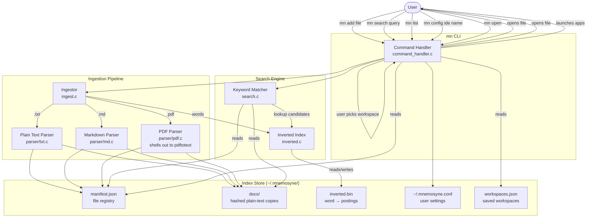

# System Architecture

## Overview

Mnemosyne is a local-first, command-line file search tool. It ingests plain and document files into a local index, then lets you search across all of them or browse the full list, and open results directly in your preferred IDE. It also manages workspaces — named sets of apps, files, and URLs that `mn open` launches together.

---

## Component Diagram



---

## Component Descriptions

### `main.c` — Entry Point
Runs first-time setup if needed, loads config, then delegates to `handle_command()` in `command_handler.c`.

### `command_handler.c` — Command Dispatcher
Routes `argv[1]` to the correct handler and implements all interactive UI logic:

| Subcommand | Handler |
|---|---|
| `add` | `ingest_file()` |
| `search` | `cmd_search()` → `run_search_picker()` → `handle_enter()` |
| `list` | `cmd_list()` → `run_list_picker()` → `handle_list_enter()` |
| `open` | `cmd_open()` → `run_workspace_picker()` → `launch_workspace()` |
| `config` | `cmd_config()` → `set_ide()` |
| `remove` | `cmd_remove()` → `remove_file()` |
| `reindex` | `cmd_reindex()` → `reindex_all()` |
| `help` | `print_help()` |

It also implements the per-platform app/IDE launch logic and `close_terminal()`, which terminates the parent shell after a successful open/launch so the launcher window closes (skipped when stdin isn't a TTY).

### `picker.c` — Interactive Terminal Pickers
The interactive pickers (ANSI rendering, raw-mode arrow-key input, `1`–`9` numeric jump) shared across the app: `run_search_picker`, `run_list_picker`, `run_workspace_picker`, `run_ide_picker`, `run_multiselect_picker`, and `run_workspace_edit_picker`.

Every text field that accepts a filesystem path (new app, add link, edit link) wraps a `PathSuggest`: it feeds each keypress to the completion dropdown before its own handling, so `↑`/`↓` move the highlight, `Tab` completes it, and `Esc` closes the list without leaving the field. `Enter` only accepts a suggestion once the highlight has been moved by hand — otherwise it submits what was typed, so a path that happens to prefix-match something is never hijacked on the way out. See `pathcomp.c` for the scanning itself.

### `pathcomp.c` — Path Completion
Backs the completion dropdown in every workspace field that takes a filesystem path. `pathcomp_update()` splits the typed buffer at its last separator, expands a leading `~`, lists that directory (`FindFirstFileA` on Windows, `dirent` elsewhere), and returns the children whose names start with the final segment — directories first, then files, case-insensitively, capped at 32. It yields nothing when the buffer has no separator or looks like a URL, so bare app names (`code`) and links (`https://…`) are left alone. `pathcomp_apply()` writes the chosen suggestion back into the caller's edit buffer, appending the separator for a directory so the next update lists its children.

The engine is stateless between keystrokes; `picker.c` owns the highlight, the dismissal state, and the rendering.

### `workspace.c` — Workspace Store
Reads and writes `workspaces.json` (via `cJSON`). A workspace is a named list of entries, each an `app` (either `code`/`cursor`, or a full path to an executable) plus optional `targets` (URLs or file paths). Functions: `workspace_create()`, `workspace_add_entry()`, `workspace_add_entry_with_targets()`, `workspace_remove()`, `workspace_load_all()`, `workspace_save_all()`.

### `ingest.c` — Ingestor
Detects file extension, delegates to the correct parser, then writes the resulting plain text into `~/.mnemosyne/index/docs/<sha256>.txt`, updates `manifest.json`, and feeds the parsed text into the inverted index. To avoid rewriting `inverted.bin` once per file in a bulk add, `ingest_path()` loads the index once at the start, accumulates additions in memory across the whole directory walk via the private `ingest_file_impl()`, and saves once at the end.

Currently supports: `.txt`, `.md`, `.pdf`. `.tex` is recognised by extension but not yet parsed.

### `parser/` — Format Parsers
Each parser receives a file path and returns a heap-allocated `char *` of plain text. The caller owns the buffer and frees it.

| File | Handles | Strategy |
|---|---|---|
| `txt.c` | `.txt` | `fread` directly |
| `md.c` | `.md` | strip formatting markers; emit `[LIST]`, `[LINK]` tokens; preserve original casing |
| `pdf.c` | `.pdf` | shell out to `pdftotext` (poppler-utils); on Windows, prefer a bundled copy next to `mn.exe` before falling back to PATH |
| `parser.c` | dispatch | routes to the correct parser by `FileType` |

### `index.c` — Index Store
Reads and writes `manifest.json`. Each entry:

```json
{
  "original_path": "/home/user/notes.txt",
  "hash": "a3f5c9...",
  "size_bytes": 4096,
  "last_modified": 1718400000,
  "file_type": "txt",
  "repository": "/home/user/myproject"
}
```

Functions: `index_add()`, `index_remove()`, `index_get_entries()`, `find_outermost_git_root()`.

`find_outermost_git_root()` walks up from a starting directory and returns the outermost ancestor containing `.git` (writes `"none"` if no ancestor has one). Used at ingest time to populate `repository`, and by `relocate.c` to widen the scan root when locating moved files — picking the outermost rather than innermost root handles nested git repos / submodules cleanly.

### `search.c` — Keyword Matcher
Asks `inverted.c` for the candidate doc set first (via `inverted_query()`), then iterates only those manifest entries — plus any whose `original_path` substring-matches the raw query — and runs the per-file scanner to count occurrences via `strstr()`, build a 256-character context snippet, and verify case for `-c`. Results are sorted by recency then match count. If `inverted.bin` is missing or unreadable (e.g. first run after upgrading from v1), `search.c` triggers a rebuild via `inverted_rebuild()` before querying.

### `inverted.c` — Inverted Index
Owns `~/.mnemosyne/index/inverted.bin`. Tokenises text into lowercased alphanumeric runs and stores `word → [(doc_id, position), …]` postings, with a doc table mapping small integer `doc_id`s back to the sha256 hashes used by the manifest. Phrase queries (`"simplex algorithm"`) are handled by intersecting postings and then checking that the positions are consecutive within the same doc.

Public API: `inverted_load()`, `inverted_save()`, `inverted_free()`, `inverted_add_doc()`, `inverted_query()`, `inverted_exists()`, `inverted_doc_count()`, `inverted_rebuild()`. The rebuild walks every manifest entry and re-tokenises its stored doc; used by `mn remove`, `mn reindex`, and the auto-recovery path in `search.c`.

### `config.c` — Config Manager
Reads and writes `~/.mnemosyne.conf` — a plain-text file with two lines: the data directory path and the IDE key.

### `remove.c` — Index Removal
Removes an entry from `manifest.json` and deletes the corresponding `docs/<hash>.txt` file. After a successful removal (single file or whole folder), calls `inverted_rebuild()` so `inverted.bin` no longer references the removed doc.

### `reindex.c` — Bulk Reindex
Walks every entry in `manifest.json`. First runs `relocate_scan_all()` so missing files are relocated where possible; remaining present files are re-parsed via `ingest_file()`. Finishes with a `inverted_rebuild()` to canonicalise `inverted.bin` against the new manifest state. Used by `mn reindex` to recover from parser changes or hand-deleted `docs/` files in one shot.

### `relocate.c` — Moved-File Tracking
For each indexed entry whose file is no longer at `original_path`, scans the entry's git repository (widened via `find_outermost_git_root()`) for a file with the same basename. A single match is re-ingested at the new location; zero or multiple matches drop the stale entry.

Also runs a cross-repo fallback: if the file isn't in its own repo, every other distinct widened repository in the index is scanned too. Matches accumulate across repos, so the same basename appearing in two unrelated repos correctly registers as ambiguous and drops the entry. Entries with `repository == "none"` have no anchor to search from and are dropped on the first miss.

Called from `reindex_all()` and from `update_files()` in `command_handler.c` (the silent pre-search pass), so moves are picked up on the next `mn search` without an explicit reindex. Functions: `relocate_scan_all()`.

### `init.c` — First-time Setup
Prompts for storage location and IDE on first run, creates the index directory structure, and writes the initial `~/.mnemosyne.conf`.

---

## Source File Structure

```
Mnemosyne/
├── src/
│   ├── main.c
│   ├── command_handler.c
│   ├── command_handler.h
│   ├── ingest.c
│   ├── ingest.h
│   ├── index.c
│   ├── index.h
│   ├── search.c
│   ├── search.h
│   ├── inverted.c
│   ├── inverted.h
│   ├── remove.c
│   ├── remove.h
│   ├── reindex.c
│   ├── reindex.h
│   ├── relocate.c
│   ├── relocate.h
│   ├── config.c
│   ├── config.h
│   ├── init.c
│   ├── init.h
│   ├── help.c
│   ├── help.h
│   ├── picker.c
│   ├── picker.h
│   ├── pathcomp.c
│   ├── pathcomp.h
│   ├── workspace.c
│   ├── workspace.h
│   ├── types.h
│   ├── sha256.c
│   ├── sha256.h
│   ├── cJSON.c
│   ├── cJSON.h
│   └── parser/
│       ├── parser.c
│       ├── parser.h
│       ├── txt.c
│       ├── txt.h
│       ├── md.c
│       ├── md.h
│       ├── pdf.c
│       └── pdf.h
├── documentation/
│   ├── structure.md      ← this file
│   ├── commands.md
│   ├── file-types.md
│   ├── development.md
│   └── roadmap.md
├── scripts/
│   └── fetch-poppler.ps1 ← Windows-only: downloads bundled pdftotext
├── Makefile
├── build.bat
├── .gitignore
└── README.md
```

---

## Runtime Data Layout

```
~/.mnemosyne.conf          ← IDE key and data directory path (plain text)

~/.mnemosyne/              ← default data directory (configurable)
├── workspaces.json        ← saved workspaces (apps, targets)
└── index/
    ├── manifest.json
    ├── inverted.bin
    └── docs/
        ├── a3f5c9d2....txt
        ├── b81e04f7....txt
        └── ...
```

- Each `docs/<hash>.txt` contains the extracted plain-text of one document.
- The hash is SHA-256 of the original file's absolute path (not its content), so re-indexing the same path overwrites the same slot.
- `manifest.json` is the only file that maps hashes back to original paths and metadata.
- `inverted.bin` is the word-to-postings lookup used by `mn search`. It stores a small integer `doc_id` per file (mapping back to the manifest's sha256 hash via a doc table at the top of the file) and a list of `(doc_id, position)` postings per word. Rebuilt on demand from `docs/` by `mn remove`, `mn reindex`, and `mn search` when the file is missing or unreadable.
- `workspaces.json` holds the named workspaces managed by `mn open`.
