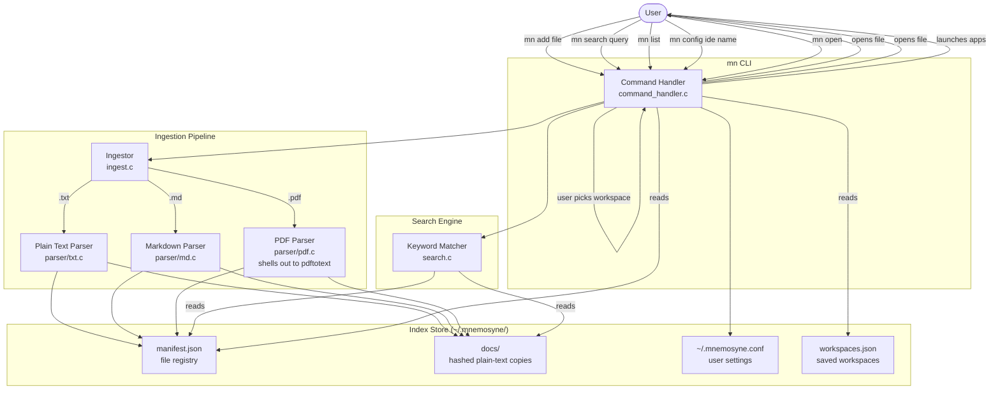

# System Architecture

## Overview

Mnemosyne is a local-first, command-line file search tool. It ingests plain and document files into a local index, then lets you search across all of them or browse the full list, and open results directly in your preferred IDE. It also manages workspaces — named sets of apps, files, and URLs that `mn open` launches together.

---

## Component Diagram



---

## Component Descriptions

### `main.c` — Entry Point
Runs first-time setup if needed, loads config, then delegates to `handle_command()` in `command_handler.c`.

### `command_handler.c` — Command Dispatcher
Routes `argv[1]` to the correct handler and implements all interactive UI logic:

| Subcommand | Handler |
|---|---|
| `add` | `ingest_file()` |
| `search` | `cmd_search()` → `run_search_picker()` → `handle_enter()` |
| `list` | `cmd_list()` → `run_list_picker()` → `handle_list_enter()` |
| `open` | `cmd_open()` → `run_workspace_picker()` → `launch_workspace()` |
| `config` | `cmd_config()` → `set_ide()` |
| `remove` | `cmd_remove()` → `remove_file()` |
| `help` | `print_help()` |

It also implements the per-platform app/IDE launch logic and `close_terminal()`, which terminates the parent shell after a successful open/launch so the launcher window closes (skipped when stdin isn't a TTY).

### `picker.c` — Interactive Terminal Pickers
The interactive pickers (ANSI rendering, raw-mode arrow-key input, `1`–`9` numeric jump) shared across the app: `run_search_picker`, `run_list_picker`, `run_workspace_picker`, `run_ide_picker`, `run_multiselect_picker`, and `run_workspace_edit_picker`.

### `workspace.c` — Workspace Store
Reads and writes `workspaces.json` (via `cJSON`). A workspace is a named list of entries, each an `app` (either `code`/`cursor`, or a full path to an executable) plus optional `targets` (URLs or file paths). Functions: `workspace_create()`, `workspace_add_entry()`, `workspace_add_entry_with_targets()`, `workspace_remove()`, `workspace_load_all()`, `workspace_save_all()`.

### `ingest.c` — Ingestor
Detects file extension, delegates to the correct parser, then writes the resulting plain text into `~/.mnemosyne/index/docs/<sha256>.txt` and updates `manifest.json`.

Currently supports: `.txt`, `.md`, `.pdf`. `.tex` is recognised by extension but not yet parsed.

### `parser/` — Format Parsers
Each parser receives a file path and returns a heap-allocated `char *` of plain text. The caller owns the buffer and frees it.

| File | Handles | Strategy |
|---|---|---|
| `txt.c` | `.txt` | `fread` directly |
| `md.c` | `.md` | strip formatting markers; lowercase output; emit `[LIST]`, `[LINK]` tokens |
| `pdf.c` | `.pdf` | shell out to `pdftotext` (poppler-utils); on Windows, prefer a bundled copy next to `mn.exe` before falling back to PATH |
| `parser.c` | dispatch | routes to the correct parser by `FileType` |

### `index.c` — Index Store
Reads and writes `manifest.json`. Each entry:

```json
{
  "original_path": "/home/user/notes.txt",
  "hash": "a3f5c9...",
  "size_bytes": 4096,
  "last_modified": 1718400000,
  "file_type": "txt",
  "repository": "/home/user/myproject"
}
```

Functions: `index_add()`, `index_remove()`, `index_get_entries()`.

### `search.c` — Keyword Matcher (v1)
Iterates over all `docs/<hash>.txt` files. For each, counts occurrences of the (already-lowercased) query string using `strstr()`. Builds a result list sorted by recency then match count. Provides a 256-character context snippet centred on the first match.

### `config.c` — Config Manager
Reads and writes `~/.mnemosyne.conf` — a plain-text file with two lines: the data directory path and the IDE key.

### `remove.c` — Index Removal
Removes an entry from `manifest.json` and deletes the corresponding `docs/<hash>.txt` file.

### `init.c` — First-time Setup
Prompts for storage location and IDE on first run, creates the index directory structure, and writes the initial `~/.mnemosyne.conf`.

---

## Source File Structure

```
Mnemosyne/
├── src/
│   ├── main.c
│   ├── command_handler.c
│   ├── command_handler.h
│   ├── ingest.c
│   ├── ingest.h
│   ├── index.c
│   ├── index.h
│   ├── search.c
│   ├── search.h
│   ├── remove.c
│   ├── remove.h
│   ├── config.c
│   ├── config.h
│   ├── init.c
│   ├── init.h
│   ├── help.c
│   ├── help.h
│   ├── picker.c
│   ├── picker.h
│   ├── workspace.c
│   ├── workspace.h
│   ├── types.h
│   ├── sha256.c
│   ├── sha256.h
│   ├── cJSON.c
│   ├── cJSON.h
│   └── parser/
│       ├── parser.c
│       ├── parser.h
│       ├── txt.c
│       ├── txt.h
│       ├── md.c
│       ├── md.h
│       ├── pdf.c
│       └── pdf.h
├── documentation/
│   ├── structure.md      ← this file
│   ├── commands.md
│   ├── file-types.md
│   ├── development.md
│   └── roadmap.md
├── scripts/
│   └── fetch-poppler.ps1 ← Windows-only: downloads bundled pdftotext
├── Makefile
├── build.bat
├── .gitignore
└── README.md
```

---

## Runtime Data Layout

```
~/.mnemosyne.conf          ← IDE key and data directory path (plain text)

~/.mnemosyne/              ← default data directory (configurable)
├── workspaces.json        ← saved workspaces (apps, targets)
└── index/
    ├── manifest.json
    └── docs/
        ├── a3f5c9d2....txt
        ├── b81e04f7....txt
        └── ...
```

- Each `docs/<hash>.txt` contains the extracted plain-text of one document.
- The hash is SHA-256 of the original file's absolute path (not its content), so re-indexing the same path overwrites the same slot.
- `manifest.json` is the only file that maps hashes back to original paths and metadata.
- `workspaces.json` holds the named workspaces managed by `mn open`.
